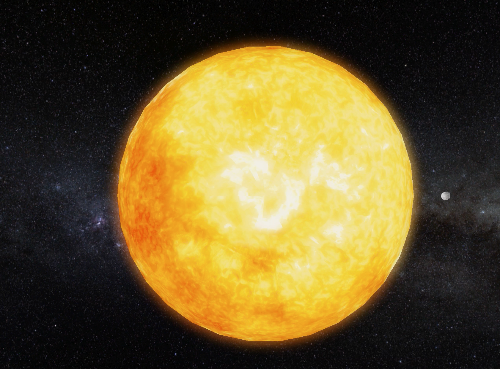

#  CS-GY 6533 Interactive Computer Graphics - Fall 2022

### Final Project
*Stephanie Hou*

<sh6403@nyu.edu>

Our final project is recreating the solar system in OpenGL. We will be visualizing an artificial solar system in a 3D space and allowing a user to move around in first-person view.  In total, there will be a sun and eight planets that orbit the sun. The sun will act as our main light source. 

### Overview

### Instructions
To run the program, use the following commands:
```
git clone https://github.com/nyu-cs-gy-6533-fall-2022/assignment-5-final-project-icg.git 
cd assignment-5-final-project-icg
mkdir build 
cd build
cmake ../
make
 ./ICGFinalProject_bin
```

### Core Features / Tasks

1. Free-Roam Camera
2. Mouse Controls
3. Specular Highlights On Oceans
4. Gamma Correction
5. Bloom Shader
6. Skybox

### Free-Roam Camera / Mouse Controls / Skybox


### Specular Highlights On Oceans


### Gamma Correction


### Bloom Shader



